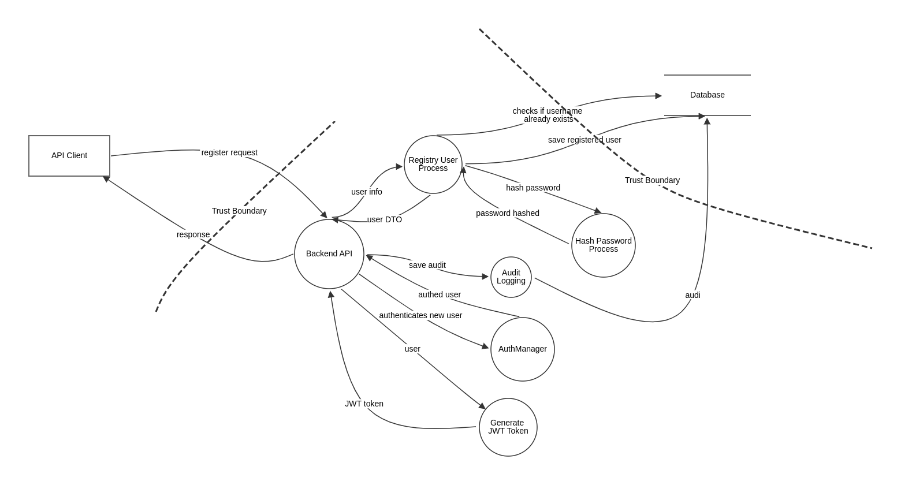

# Threat Modeling Report - Authentication Registration Functionality

---

# 1. DFD Overview

## System Context

The registration functionality allows unauthenticated clients to submit user data to `POST /api/auth/register`.
The backend validates input, enforces registration rules, persists a new user with safe defaults, and logs the outcome.

System components:
- API Client (external actor)
- Auth Controller (HTTP registration entrypoint)
- User Service (registration and role assignment logic)
- User DB (identity and credential persistence)
- Audit Log Store (registration traceability)

---

## DFD Diagram

---

## Main Components

### Actor
- API Client

### Processes
- Backend API (registration endpoint)
- Registry User Process
- Hash Password Process
- AuthManager
- Generate JWT Token
- Audit Logging

### Data Stores
- Database (user records and audit entries)

### Trust Boundaries
- Between API Client and Backend API (public API boundary)
- Between registration processing and Database (internal trust boundary)

---

# 2. Threat Mapping

| Registration Flow Focus | Threat IDs | Notes |
|---|---|---|
| Identity and anti-automation abuse | T-003, T-011 | Covers fake account creation and registration flooding. |
| Role and privilege assignment abuse | T-004, T-002 | Covers client-side role injection and weak privilege defaults. |
| Input tampering and validation bypass | T-005 | Covers crafted registration payload manipulation. |
| Information disclosure | T-008, T-009 | Covers duplicate-user enumeration and PII leakage. |
| Audit and accountability | T-010 | Covers repudiation and traceability completeness. |
| Credential-processing exhaustion | T-012 | Covers expensive hashing abuse in registration path. |

## Risk Prioritization (Flow View)

### High Risk
- T-004 Provisioning privilege abuse (role/default assignment)
- T-011 Registration flood and anti-automation bypass
- T-003 Fake identity and account seeding for later abuse

### Medium Risk
- T-005 Payload tampering and validation bypass
- T-008 Enumeration through duplicate handling
- T-009 PII disclosure in logs/errors

### Low Risk
- T-010 Repudiation if audit controls are incomplete

---

# 3. Countermeasures and Mitigation

## Accept
- Low-impact UX telemetry gaps can be accepted if identity, role assignment, and audit fields remain complete.

## Eliminate
- Any client-controlled role assignment input.
- Verbose duplicate-user error semantics that enable enumeration.
- Logging of full registration payload fields that are not required for security audit.

## Mitigate

### Identity and Access Controls
- Assign role server-side only (`USER` by default), ignore client role fields.
- Enforce strict DTO validation (format, length, charset, and allowlists).
- Add optional out-of-band verification (email/phone) before account activation.

### Abuse Protection
- Apply per-IP and per-identity rate limiting for registration.
- Add CAPTCHA/challenge controls for anomalous registration patterns.
- Monitor spikes in account creation and repeated source patterns.

### Data Protection
- Hash passwords using strong adaptive algorithms and tuned cost factors.
- Return generic registration failure responses to reduce enumeration.
- Redact PII in logs and traces.

### Logging and Audit
- Record registration attempts with request metadata and security outcome.
- Protect audit logs with integrity controls and retention policy.
- Alert on suspicious registration campaigns.

## Transfer
- Use managed anti-automation and bot detection services for public registration endpoints.
- Integrate centralized SIEM/SOAR pipelines for registration abuse detection.

