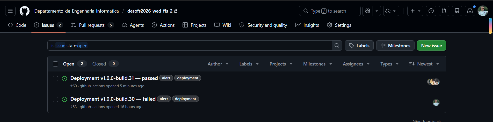
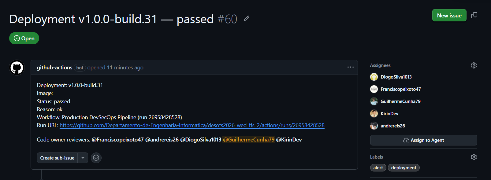

# Phase 2 - Sprint 2 Summary

## 1. Executive Summary

Phase 2 Sprint 2 extends the production delivery path with operational assurance after deployment. The sprint work keeps the Phase 1 SSDLC traceability model and adds controls that validate the deployed production service, fail the deployment when post-deploy checks fail, and trigger an automated rollback during the same workflow run.

The primary source for Sprint 2 scope is [Planning.md](Planning.md). This summary consolidates the implemented evidence for `SDR-011`, `SDR-012`, `NFR-014`, `SR-023`, and `SDR-014`, and leaves placeholders for the remaining Sprint 2 workstreams so evidence can be added in the same structure as Sprint 1.

This summary also captures the document upload hardening work implemented in the backend. The upload path now enforces a configurable PDF-only allowlist and inspects PDF content before storage so the application accepts only valid, structurally safe PDF files.

Sprint 2 also closes selected OWASP ASVS V1 and V4 evidence gaps. V1 coverage was strengthened through response-header sanitization and literal search-pattern handling, while V4 coverage was strengthened through explicit API content-type behavior and HTTP method allowlisting.

### Phase 2 Sprint 2 Activities Summary

Sprint 2 work is organized around the following themes derived from [Planning.md](Planning.md):

- Production observability and operations: Prometheus monitoring, Grafana dashboards/logging, structured application logging, and backup/restore controls.
- Post-deployment assurance: production performance smoke tests, lightweight production security tests, public application URL validation, and workflow summaries.
- Rollback and deployment recovery: Swarm rollback automation, readiness checks after rollback, and deployment alert issues for review and auditability.
- Domain validation and security test expansion: domain-level value objects, additional deny-path tests, and updated engineering guidance.
- ASVS V1/V4 hardening: encoding and sanitization at interpreter-sensitive boundaries, explicit REST response semantics, and unsupported HTTP method rejection.

### Information Organization Rationale

Sprint 2 follows the same traceability principle used in Sprint 1:

**planning item -> implementation area -> validation activity -> evidence -> sprint summary**

## 2. Scope of this Delivery

The current Sprint 2 delivery covers:

1. Sprint backlog planning with status, owner, priority, and dependencies.
2. `SDR-011` post-deployment validation tests after production deployment.
3. `SDR-012` automated rollback after failed post-deployment validation.
4. `SDR-013` Deployment alert issue evidence with CODEOWNERS notification/assignment.
5. `SR-021` domain validation value objects for user and department.
6. `SR-022` domain validation value objects for document metadata and audit fields.
7. `SR-017` Document upload hardening for PDF-only validation and malicious PDF detection.
8. `SR-023` encoding and search-pattern sanitization hardening.
9. `SDR-014` additional security-focused tests and ASVS V1/V4 evidence updates.
10. `NFR-014` API HTTP semantics and method hardening.
11. `NFR-012` automated volume backups with retention and restore validation.
12. `NFR-010` production Prometheus monitoring with alerting and Grafana dashboards.

## 3. Current Delivered Artifacts

- [Planning.md](Planning.md)
- [../../../.github/workflows/main-workflow.yml](../../../.github/workflows/main-workflow.yml)
- [../../../.github/scripts/post-deploy-performance.py](../../../.github/scripts/post-deploy-performance.py)
- [../../../.github/scripts/post-deploy-security.py](../../../.github/scripts/post-deploy-security.py)
- [../../../.github/scripts/backup/backup.sh](../../../.github/scripts/backup/backup.sh)
- [../../../.github/scripts/backup/backup-runbook.md](../../../.github/scripts/backup/backup-runbook.md)
- [../../../deployment/remote-deploy.sh](../../../deployment/remote-deploy.sh)
- [../../../deployment/remote-rollback.sh](../../../deployment/remote-rollback.sh)
- [../../../deployment/docker-compose.swarm.yml](../../../deployment/docker-compose.swarm.yml)
- [../../../deployment/observability/prometheus/prometheus.yml](../../../deployment/observability/prometheus/prometheus.yml)
- [../../../deployment/observability/prometheus/rules/alerts.yml](../../../deployment/observability/prometheus/rules/alerts.yml)
- [../../../deployment/observability/grafana/dashboards/desofs-overview.json](../../../deployment/observability/grafana/dashboards/desofs-overview.json)
- [../../../deployment/README.md](../../../deployment/README.md)
- [../../../infrastructure/terraform/README.md](../../../infrastructure/terraform/README.md)
- [../../../infrastructure/terraform/envs/prod/outputs.tf](../../../infrastructure/terraform/envs/prod/outputs.tf)
- [images/deployment-notification-issue-list.png](images/deployment-notification-issue-list.png)
- [images/deployment-notification-issue-details.png](images/deployment-notification-issue-details.png)
- [../../../backend/src/main/java/com/desofs/project/document/model/DocumentMetadata.java](../../../backend/src/main/java/com/desofs/project/document/model/DocumentMetadata.java)
- [../../../backend/src/main/java/com/desofs/project/audit/model/AuditFields.java](../../../backend/src/main/java/com/desofs/project/audit/model/AuditFields.java)
- [../../../backend/src/main/java/com/desofs/project/config/SecurityConfig.java](../../../backend/src/main/java/com/desofs/project/config/SecurityConfig.java)
- [../../../backend/src/main/java/com/desofs/project/document/controller/DocumentController.java](../../../backend/src/main/java/com/desofs/project/document/controller/DocumentController.java)
- [../../../backend/src/main/java/com/desofs/project/document/services/DocumentDownload.java](../../../backend/src/main/java/com/desofs/project/document/services/DocumentDownload.java)
- [../../../backend/src/main/java/com/desofs/project/shared/persistence/LikePatternEscaper.java](../../../backend/src/main/java/com/desofs/project/shared/persistence/LikePatternEscaper.java)
- [../../../backend/src/main/java/com/desofs/project/document/repositories/DocumentRepositoryImpl.java](../../../backend/src/main/java/com/desofs/project/document/repositories/DocumentRepositoryImpl.java)
- [../../../backend/src/main/java/com/desofs/project/department/repositories/DepartmentRepositoryImpl.java](../../../backend/src/main/java/com/desofs/project/department/repositories/DepartmentRepositoryImpl.java)
- [../../../backend/src/test/java/com/desofs/project/document/model/DocumentTest.java](../../../backend/src/test/java/com/desofs/project/document/model/DocumentTest.java)
- [../../../backend/src/test/java/com/desofs/project/audit/model/AuditLogTest.java](../../../backend/src/test/java/com/desofs/project/audit/model/AuditLogTest.java)
- [../../../backend/src/test/java/com/desofs/project/document/controller/ApiHttpSemanticsIT.java](../../../backend/src/test/java/com/desofs/project/document/controller/ApiHttpSemanticsIT.java)
- [../../../backend/src/test/java/com/desofs/project/document/controller/DocumentControllerTest.java](../../../backend/src/test/java/com/desofs/project/document/controller/DocumentControllerTest.java)
- [../../../backend/src/test/java/com/desofs/project/repositories/RepositoryImplDataJpaTest.java](../../../backend/src/test/java/com/desofs/project/repositories/RepositoryImplDataJpaTest.java)
- [ASVS_5.0_Tracker.xlsx](ASVS_5.0_Tracker.xlsx)

## 4. Sprint 2 Evidence Register

| Evidence area | Related planning items | Current artifact                                                                                                                                                                                                                                                                                                                                                                                                                                                                                                                                                                                                                                                                                                                                                                                                                                                                                                                                                                             |
|---|---|----------------------------------------------------------------------------------------------------------------------------------------------------------------------------------------------------------------------------------------------------------------------------------------------------------------------------------------------------------------------------------------------------------------------------------------------------------------------------------------------------------------------------------------------------------------------------------------------------------------------------------------------------------------------------------------------------------------------------------------------------------------------------------------------------------------------------------------------------------------------------------------------------------------------------------------------------------------------------------------------|
| Sprint planning and workstreams | All Sprint 2 items | [Planning.md](Planning.md)                                                                                                                                                                                                                                                                                                                                                                                                                                                                                                                                                                                                                                                                                                                                                                                                                                                                                                                                                                   |
| Post-deployment performance and security validation | `SDR-011`, `NFR-004`, `SDR-007` | `post-deploy-validation` job in [main-workflow.yml](../../../.github/workflows/main-workflow.yml), [post-deploy-performance.py](../../../.github/scripts/post-deploy-performance.py), [post-deploy-security.py](../../../.github/scripts/post-deploy-security.py)                                                                                                                                                                                                                                                                                                                                                                                                                                                                                                                                                                                                                                                                                                                            |
| Public production validation URL configuration | `SDR-011`, `NFR-009` | `AWS_APP_BASE_URL` handling in [main-workflow.yml](../../../.github/workflows/main-workflow.yml), [Terraform outputs](../../../infrastructure/terraform/envs/prod/outputs.tf), [deployment README](../../../deployment/README.md)                                                                                                                                                                                                                                                                                                                                                                                                                                                                                                                                                                                                                                                                                                                                                            |
| Automated rollback after validation failure | `SDR-012`, `SDR-011` | `rollback-on-post-deploy-failure` job in [main-workflow.yml](../../../.github/workflows/main-workflow.yml), [remote-rollback.sh](../../../deployment/remote-rollback.sh), Swarm rollback settings in [docker-compose.swarm.yml](../../../deployment/docker-compose.swarm.yml)                                                                                                                                                                                                                                                                                                                                                                                                                                                                                                                                                                                                                                                                                                                |
| Deployment alert and CODEOWNERS notification evidence | `SDR-011`, `SDR-012`, `SDR-009`, `SDR-010` | `notify-deployment` job in [main-workflow.yml](../../../.github/workflows/main-workflow.yml), [issue list screenshot](images/deployment-notification-issue-list.png), [issue details screenshot](images/deployment-notification-issue-details.png)                                                                                                                                                                                                                                                                                                                                                                                                                                                                                                                                                                                                                                                                                                                                           |
| Production Prometheus monitoring | `NFR-010` | [Prometheus Config](../../../deployment/observability/prometheus/prometheus.yml), [Alerts Config](../../../deployment/observability/prometheus/rules/alerts.yml), [Grafana Config Updated](../../../deployment/observability/grafana/dashboards/desofs-overview.json)                                                                                                                                                                                                                                                                                                                                                                                                                                                                                                                                                                                                                                                                                                                                    |
| Grafana logging and observability integration | `NFR-011` | [Loki Config](../../../deployment/observability/loki/loki.yml), [Promtail Config](../../../deployment/observability/promtail/promtail.yml), [Grafana Provisioning](../../../deployment/observability/grafana/provisioning/), Loki and Promtail services in [docker-compose.swarm.yml](../../../deployment/docker-compose.swarm.yml), updated Grafana dashboards in [desofs-overview.json](../../../deployment/observability/grafana/dashboards/desofs-overview.json).                                                                                                                                                                                                                                                                                                                                                                                                                                                                                                                                                                                                                                                                                                                                                                                                                                                                                                                               |
| Automated volume backups | `NFR-012` | [Backup Script](../../../.github/scripts/backup/backup.sh)                                                                                                                                                                                                                                                                                                                                                                                                                                                                                                                                                                                                                                                                                                                                                                                                                                                                                                                                   |
| Structured application logging | `NFR-013` | [logback-spring.xml](../../../backend/src/main/resources/logback-spring.xml), [RequestIdFilter](../../../backend/src/main/java/com/desofs/project/config/RequestIdFilter.java), JSON log parsing in [Promtail Config](../../../deployment/observability/promtail/promtail.yml), structured logging context in [DocumentService](../../../backend/src/main/java/com/desofs/project/document/services/DocumentService.java), [FileStorageService](../../../backend/src/main/java/com/desofs/project/infrastructure/filesystem/FileStorageService.java), and [application.yml](../../../backend/src/main/resources/application.yml) logging configuration.                                                                                                                                                                                                                                                                                                                                                                                                                                                                                                                                                                                                                                                                                                                                                                                                                                                                                                                |
| API HTTP semantics and method hardening | `NFR-014`, `SDR-014`, ASVS V4 | [SecurityConfig](../../../backend/src/main/java/com/desofs/project/config/SecurityConfig.java), [DocumentController](../../../backend/src/main/java/com/desofs/project/document/controller/DocumentController.java), [DocumentDownload](../../../backend/src/main/java/com/desofs/project/document/services/DocumentDownload.java), and [ApiHttpSemanticsIT](../../../backend/src/test/java/com/desofs/project/document/controller/ApiHttpSemanticsIT.java).                                                                                                                                                                                                                                                                                                                                                                                                                                                                                                                                 |
| Domain validation value objects for user and department | `SR-021` | Placeholder: add value object classes, mapper updates, and test evidence when complete.                                                                                                                                                                                                                                                                                                                                                                                                                                                                                                                                                                                                                                                                                                                                                                                                                                                                                                      |
| Domain validation value objects for document and audit | `SR-022`, `SR-008`, `SR-010` | [DocumentMetadata](../../../backend/src/main/java/com/desofs/project/document/model/DocumentMetadata.java), [AuditFields](../../../backend/src/main/java/com/desofs/project/audit/model/AuditFields.java), mapper hydration in [DocumentPersistenceMapper](../../../backend/src/main/java/com/desofs/project/document/mapper/DocumentPersistenceMapper.java) and [AuditPersistenceMapper](../../../backend/src/main/java/com/desofs/project/audit/mapper/AuditPersistenceMapper.java), invalid-object tests in [DocumentTest](../../../backend/src/test/java/com/desofs/project/document/model/DocumentTest.java), [AuditLogTest](../../../backend/src/test/java/com/desofs/project/audit/model/AuditLogTest.java), [DocumentPersistenceMapperTest](../../../backend/src/test/java/com/desofs/project/document/mapper/DocumentPersistenceMapperTest.java), and [AuditPersistenceMapperTest](../../../backend/src/test/java/com/desofs/project/audit/mapper/AuditPersistenceMapperTest.java). |
| PDF upload validation and malicious content inspection | `SDR-014`, `SR-022`, security hardening | [DocumentUploadValidationService](../../../backend/src/main/java/com/desofs/project/document/services/DocumentUploadValidationService.java), configurable allowlist in [application.yml](../../../backend/src/main/resources/application.yml), upload flow integration in [DocumentService](../../../backend/src/main/java/com/desofs/project/document/services/DocumentService.java), and validation tests in [DocumentUploadValidationServiceTest](../../../backend/src/test/java/com/desofs/project/document/services/DocumentUploadValidationServiceTest.java) and [DocumentControllerIT](../../../backend/src/test/java/com/desofs/project/document/controller/DocumentControllerIT.java).                                                                                                                                                                                                                                                                                              |
| Encoding and search-pattern sanitization hardening | `SR-023`, `SDR-014`, ASVS V1 | [DocumentController](../../../backend/src/main/java/com/desofs/project/document/controller/DocumentController.java), [LikePatternEscaper](../../../backend/src/main/java/com/desofs/project/shared/persistence/LikePatternEscaper.java), [DocumentRepositoryImpl](../../../backend/src/main/java/com/desofs/project/document/repositories/DocumentRepositoryImpl.java), [DepartmentRepositoryImpl](../../../backend/src/main/java/com/desofs/project/department/repositories/DepartmentRepositoryImpl.java), [DocumentControllerTest](../../../backend/src/test/java/com/desofs/project/document/controller/DocumentControllerTest.java), [RepositoryImplDataJpaTest](../../../backend/src/test/java/com/desofs/project/repositories/RepositoryImplDataJpaTest.java), and [ASVS_5.0_Tracker.xlsx](ASVS_5.0_Tracker.xlsx).                                                                                                                                                                    |
| Additional security-focused tests | `SDR-014`, `SDR-008`, `NFR-014`, `SR-023` | [UserControllerIT](../../../backend/src/test/java/com/desofs/project/user/controller/UserControllerIT.java), [DepartmentControllerIT](../../../backend/src/test/java/com/desofs/project/department/controller/DepartmentControllerIT.java), [DocumentControllerIT](../../../backend/src/test/java/com/desofs/project/document/controller/DocumentControllerIT.java), [ApiHttpSemanticsIT](../../../backend/src/test/java/com/desofs/project/document/controller/ApiHttpSemanticsIT.java), [DocumentControllerTest](../../../backend/src/test/java/com/desofs/project/document/controller/DocumentControllerTest.java), [DocumentServiceTest](../../../backend/src/test/java/com/desofs/project/document/services/DocumentServiceTest.java), [RepositoryImplDataJpaTest](../../../backend/src/test/java/com/desofs/project/repositories/RepositoryImplDataJpaTest.java), and passing Maven/Failsafe test evidence.                                                                            |

## 5. Current Consolidated Evidence

The following evidence is consolidated here to avoid maintaining duplicated sprint evidence across operational READMEs.

### SDR-011 - Post-Deployment Validation Tests

`SDR-011` is implemented through the `post-deploy-validation` job in the production workflow. The job runs after `deploy-production` and executes two production-facing checks:

- `post-deploy-performance.py` sends repeated HTTP requests to `PERF_TARGET_URLS`, records latency, computes average and p95 response time, and fails when requests fail, unexpected statuses are returned, or latency thresholds are exceeded.
- `post-deploy-security.py` performs lightweight production security checks by verifying that unauthenticated access and invalid bearer tokens are rejected on a protected endpoint, and that invalid login credentials do not succeed.

The workflow resolves validation targets using `AWS_APP_BASE_URL`, not the EC2-local `AWS_HEALTHCHECK_URL`. This distinction is important because `AWS_HEALTHCHECK_URL` points at the management readiness endpoint on `127.0.0.1` and is only valid inside the EC2 host during deploy and rollback. GitHub-hosted runners validate the public application URL instead.

The performance smoke test targets `/api/users`, which is a protected endpoint. A reachable production deployment should return `401` or `403` for unauthenticated requests. The performance script therefore supports `PERF_SUCCESS_STATUSES`, and the workflow sets it to `401,403` for this post-deploy smoke test.

Local validation evidence collected during Sprint 2:

- `curl -i <AWS_APP_BASE_URL>/api/users` returned `401`, confirming the production API was reachable on the configured public port and protected from unauthenticated access.
- `py -3 .github/scripts/post-deploy-performance.py` returned `Performance checks passed.` with `PERF_TARGET_URLS=<AWS_APP_BASE_URL>/api/users` and `PERF_SUCCESS_STATUSES=401,403`.
- `py -3 .github/scripts/post-deploy-security.py` returned `Security checks passed.` with `SECURITY_BASE_URL=<AWS_APP_BASE_URL>`. The HTTP warning is expected until HTTPS is configured for production.
- `py -3 -m py_compile .github/scripts/post-deploy-performance.py .github/scripts/post-deploy-security.py` passed.

Acceptance status: failures in either script return a non-zero exit code, causing `post-deploy-validation` to fail and marking the deployment result as failed in the pipeline.

### SDR-012 - Automated Rollback On Validation Failure

`SDR-012` is implemented through the `rollback-on-post-deploy-failure` job in the production workflow. The job depends on both `deploy-production` and `post-deploy-validation` and runs with:

```yaml
if: ${{ always() && needs.post-deploy-validation.result == 'failure' }}
```

When post-deploy validation fails, the workflow reconnects to the AWS Docker Swarm host over SSH and runs `deployment/remote-rollback.sh`. The rollback script:

- verifies Docker and curl are available;
- verifies Swarm is active;
- checks that the `${STACK_NAME}_app` service exists;
- executes `docker service rollback`;
- waits for the service to converge to the desired replica count;
- checks the EC2-local readiness endpoint until it reports `UP`;
- fails the rollback job if the service does not stabilize.

The deployment path also keeps a rollout-level safety net in `remote-deploy.sh`: if the initial Swarm service convergence or readiness check fails during rollout, the script calls `docker service rollback` before exiting.

Acceptance status: a post-deploy validation failure triggers rollback in the same workflow run through `rollback-on-post-deploy-failure`. The rollback outcome is recorded in the workflow logs and reflected in the deployment notification issue.

#### Deployment Notification Evidence

The `notify-deployment` job creates a GitHub Issue after deployment status is computed. The issue records the deployment version, image reference, result, failure reason when applicable, workflow run URL, CODEOWNERS reviewer mentions, and assignees for individual CODEOWNERS users.





### SDR-013 - Engineering Guidelines Updates

`SDR-013` is implemented through the Sprint 2 updates to [guidelines.md](guidelines.md). The goal was to make local
secure-development checks easy for a new developer to reproduce before opening a pull request.

The updated guidelines document:

- SonarLint/SonarQube for IDE setup for Visual Studio Code and IntelliJ IDEA;
- connected mode with organization `desofs2026-wed-ffs-2` and project key `desofs2026-wed-ffs-2_desofs2026-wed-ffs-2`;
- the need to build the backend once so SonarLint has Java bytecode for deeper analysis;
- local OWASP Dependency-Check execution with `NVD_API_KEY`;
- generated report locations under `backend/target`;
- the rule that High or Critical dependency findings are blocking unless an exception is documented and approved;
- local testing expectations for security-relevant changes, including negative-path cases such as `401`, `403`, forbidden
  object access, and invalid input.

Project impact: developers can catch static-analysis issues, dependency vulnerabilities, and missing security tests
earlier, reducing failed CI runs and keeping local development aligned with the mandatory pipeline gates.

Acceptance status: the SonarLint and Dependency-Check setup steps are documented with the project identifiers and commands
needed for a new developer to follow them.

### SR-021 - Domain Validation Value Objects For User And Department

`SR-021` is implemented through domain value objects for user identity fields and department attributes:

- `Username` validates required usernames, trims input, enforces the 3 to 50 character range, and rejects control characters.
- `EmailAddress` validates required email addresses, trims input, enforces the 100 character limit, and requires a valid email format.
- `Password` validates required passwords, trims input, and enforces the 255 character limit used by persistence.
- `DepartmentName` validates required department names, trims input, enforces the 100 character limit, and rejects invalid blank values before persistence.
- `DepartmentDescription` treats the description as optional, but rejects blank present values and enforces the 1000 character limit.
- `UserPersistenceMapper` and `DepartmentPersistenceMapper` hydrate user and department value objects when loading database entities into domain models, so invalid persisted rows are rejected at the domain boundary instead of silently flowing through services.

Local validation evidence collected during Sprint 2:

- `UserTest` covers valid normalized values, null/blank rejection, invalid email formats, and upper length limits for username, email, and password.
- `DepartmentTest` covers valid normalized values, optional description handling, null/blank rejection, and upper length limits for department name and description.

Acceptance status: invalid user and department domain objects are rejected by value objects, and persistence mappers continue to hydrate valid domain objects with repository-assigned identifiers.

### SR-022 - Domain Validation Value Objects For Document And Audit

`SR-022` is implemented through domain value objects for document metadata and audit fields:

- `DocumentMetadata` validates filename, filepath, content type length, and non-negative document size before a `Document` can be constructed or updated.
- `AuditFields` validates actor, action, target entity type, target id, optional details, and timestamp before an `AuditLog` can be constructed or hydrated from persistence.
- `DocumentPersistenceMapper` and `AuditPersistenceMapper` now create these value objects when loading database entities into domain models, so invalid persisted rows are rejected at the domain boundary instead of silently flowing through services.

Local validation evidence collected during Sprint 2:

- `mvn -B -ntp -f backend/pom.xml test` passed with 37 tests, 0 failures, and 0 errors.
- Negative-path tests cover invalid document metadata, incomplete audit fields, and invalid mapper hydration.

Acceptance status: invalid document and audit domain objects are rejected before persistence-facing domain objects are returned to services.

### SR-017 - PDF Upload Validation And Security Inspection

The document upload path now enforces two checks before a file is stored:

- The upload allowlist is configurable through `app.file-upload.allowed-content-types` in [application.yml](../../../backend/src/main/resources/application.yml). By default, only `application/pdf` is accepted.
- The service checks the file content to validate its header to confirm it is a PDF file.
- PDF files are parsed with Apache PDFBox before storage. The validator rejects PDFs that contain active or dangerous structures such as JavaScript actions, launch actions, rich media execution, form submission actions, embedded-file references, or other additional actions on the catalog, page, or annotation layers.

This means the application does not just check the filename or the declared MIME type. It confirms that the uploaded content is actually a PDF and blocks common malicious PDF behaviors before the file can be written to disk.

If the file is not a PDF, the API returns `415 Unsupported Media Type`. If the file is a PDF but fails the security inspection, the API returns `400 Bad Request` with a safe problem detail response. The upload and replace flows share the same validation service, so the policy is enforced consistently in both entry points.

Local validation evidence collected during Sprint 2:

- `DocumentUploadValidationServiceTest` covers acceptance of a safe generated PDF, rejection of non-PDF content, and rejection of a PDF containing JavaScript.
- `DocumentControllerIT` covers the upload and replace endpoints, including the PDF-only policy and the malicious-PDF rejection path.

Acceptance status: only configured PDF types are accepted, and PDFs are scanned for dangerous active content before storage.

### NFR-014 - API HTTP Semantics And Method Hardening

`NFR-014` is implemented through explicit REST response behavior and method restrictions:

- JSON API responses are verified to declare `application/json`.
- ProblemDetail error responses are verified to declare `application/problem+json`.
- Document downloads now return the stored document media type, with a safe fallback for blank or invalid media types.
- Text and XML-compatible download media types receive `charset=UTF-8` when no charset is already defined.
- `SecurityConfig` defines a `StrictHttpFirewall` HTTP method allowlist for `GET`, `POST`, `PUT`, `DELETE`, `HEAD`, and `OPTIONS`, blocking unsupported methods such as `TRACE` and `PATCH` before they can reach application handlers.

Local validation evidence collected during Sprint 2:

- `ApiHttpSemanticsIT` verifies JSON content type, ProblemDetail content type, PDF download content type, safe download filename behavior, and rejection of unsupported HTTP methods.
- `DocumentControllerTest` verifies controller-level media type resolution for downloads.

Acceptance status: API response content types and unsupported method behavior are now covered by automated tests and recorded in the Sprint 2 ASVS V4 tracker evidence.

### SR-023 - Encoding And Search-Pattern Sanitization Hardening

`SR-023` is implemented through two targeted ASVS V1 hardening changes:

- Document download headers are no longer built by concatenating untrusted or database-originated strings into `Content-Disposition`. The controller sanitizes filenames with a conservative allowlist, falls back to the document UUID when necessary, and generates the header through Spring `ContentDisposition`.
- Department and document directory search filters now escape SQL `LIKE` metacharacters (`%`, `_`, and the escape character) before query execution. Search input remains parameterized and wildcard-like characters are treated as literal text, not query-control syntax.

Local validation evidence collected during Sprint 2:

- `DocumentControllerTest` verifies that CR/LF header-injection input is not reflected in the final `Content-Disposition` header.
- `RepositoryImplDataJpaTest` verifies that `100%_` matches only records containing the literal `%_` sequence and does not broaden the result set through wildcard semantics.
- `ASVS_5.0_Tracker.xlsx` was updated for V1 with implementation evidence and scoped `Not Applicable` decisions where the relevant interpreter or feature is not part of the REST API.

Acceptance status: response-header encoding and search-pattern escaping are implemented and tested, and the V1 ASVS tracker now records the evidence.

### SDR-014 - Additional Security-Focused Tests

`SDR-014` is completed for the Sprint 2 ASVS V1/V4 changes and additional deny-path scenarios. The added and updated tests cover:

- safe download response headers and stored download content types;
- JSON and ProblemDetail media type behavior;
- blocked unsupported HTTP methods;
- literal handling of SQL `LIKE` metacharacters in document and department search filters;
- service propagation of download metadata used by the controller;
- user directory RBAC denial for non-admin users;
- cross-user profile update denial;
- department create/update/delete authorization denial paths;
- document object-level authorization denial for replace, delete, list, and direct download flows.

Acceptance status: the Sprint 2 security-focused tests pass locally and provide direct evidence for the `NFR-014`, `SR-023`, `SDR-008`, ASVS V1, ASVS V4, and deny-path authorization updates.

### NFR-012 - Automated Volume Backups

`NFR-012` is implemented through a backup and restore system for PostgreSQL, Redis, and Docker volumes. The system ensures critical data can be recovered in case of failure.

- **Backup Execution**: Backups are performed using `/scripts/backup.sh`, which runs automatically via a daily cron job at 02:00 or can be executed manually.
- **Backup Storage Locations**:
    - PostgreSQL: `/backups/postgres/`
    - Redis: `/backups/redis/`
    - Docker Volumes: `/backups/volumes/`
    - Logs: `/backups/logs/backup.log`
- **Retention Policy**: Backups older than 7 days are automatically deleted using cleanup commands.
- **Restore Procedures**: Documented for PostgreSQL, Redis, and Docker volumes, with validation steps to ensure data integrity and application functionality.

#### Local Validation Evidence Collected During Sprint 2:
- Manual execution of `/scripts/backup.sh` successfully created timestamped backups.
- Restore procedures were tested in staging, verifying:
    - PostgreSQL tables and data integrity.
    - Redis functionality for authentication and rate limiting.
    - Docker volume restoration and file accessibility.
- Logs confirmed successful backup and restore operations.

**Acceptance Status**: The backup system is operational, with automated scheduling, manual execution, and validated restore procedures.

### NFR-010 - Production Prometheus Monitoring

`NFR-010` is implemented through the deployment of Prometheus for monitoring application, database, and infrastructure metrics. The configuration ensures comprehensive observability and alerting for production systems.

- **Prometheus Configuration**:
    - `prometheus.yml`:
        - Global scrape interval: 15 seconds.
        - Scrape targets:
            - `desofs-app`: `/actuator/prometheus` at `app:9090`.
            - `postgres`: `postgres-exporter:9187`.
            - `node`: `node-exporter:9100`.
        - Rule files: `/etc/prometheus/rules/*.yml`.

- **Alerting Rules**:
    - `alerts.yml` defines critical and warning alerts, including:
        - **ApplicationDown**: Triggers if `desofs-app` is unreachable for more than 1 minute.
        - **HighResponseTime**: Alerts when the 95th percentile response time exceeds 1 second for 5 minutes.
        - **HighJvmMemoryUsage**: Alerts if JVM heap memory usage exceeds 90% for 5 minutes.
        - **PostgresDown**: Triggers if `postgres-exporter` is unreachable for more than 1 minute.
        - **PostgresConnectionsHigh**: Alerts when PostgreSQL connection usage exceeds 80% for 5 minutes.
        - **NodeDown**: Triggers if `node-exporter` is unreachable for more than 1 minute.
        - **HighCPUUsage**: Alerts when CPU usage exceeds 80% for 5 minutes.
        - **LowAvailableMemory**: Alerts if available memory falls below 10% for 5 minutes.
        - **DiskSpaceLow**: Triggers when disk space falls below 10% for 10 minutes.

- **Grafana Dashboard Updates**:
    - Added panels for PostgreSQL and host metrics:
        - **PostgreSQL**:
            - `Postgres Up`: Monitors the availability of the PostgreSQL exporter.
            - `Active Connections`: Tracks the number of active database connections.
            - `DB Size`: Displays the size of the database.
            - `Cache Hit Ratio`: Shows the cache hit ratio for PostgreSQL.
            - `Transactions`: Monitors commit and rollback rates.
        - **Host Metrics**:
            - `Host Up`: Monitors the availability of the node exporter.
            - `CPU Usage`: Tracks CPU usage percentage.
            - `Memory Usage`: Displays memory usage in bytes.

#### Local Validation Evidence Collected During Sprint 2:
- Prometheus successfully scraped metrics from all configured targets.
- Alerts triggered correctly during simulated failure scenarios.
- Grafana dashboards displayed real-time metrics for application, database, and host systems.

**Acceptance Status**: Prometheus monitoring is operational, with validated metrics collection, alerting, and visualization through Grafana.

### NFR-011 - Grafana Logging and Observability Integration

`NFR-011` is implemented through the deployment of Grafana with a complete logging and observability stack. The implementation ensures application logs are aggregated, indexed, and visualized alongside Prometheus metrics.

- **Grafana Configuration**:
    - Grafana is provisioned with Loki and Prometheus data sources.
    - Provisioning files configure:
        - `datasources.yml`: Registers Loki (for logs) and Prometheus (for metrics).
        - `dashboards.yml`: Provides dashboard provisioning paths.
    - The `desofs-overview.json` dashboard includes logging panels for:
        - **Application Logs**: Displays structured logs from the application service.
        - **Error Tracking**: Shows error-level logs and stack traces by request ID.
        - **Request Tracing**: Allows filtering logs by request ID for distributed request tracking.

- **Loki and Promtail Stack**:
    - `loki:3100` stores logs in filesystem storage with a 24-hour retention period.
    - `promtail:9080` scrapes container logs from Docker using the Docker SD (Service Discovery) configuration.
    - Promtail extracts structured fields from JSON logs (level, logger, message, request_id, service) and forwards them to Loki.
    - Volumes ensure persistent log storage at `/loki`.

- **Docker Compose Integration**:
    - `deployment/docker-compose.swarm.yml` defines services for `loki` and `promtail` with proper constraints and restart policies.
    - Services are configured to run on the manager node with restart-on-failure strategies.
    - Promtail mounts `/var/run/docker.sock` and `/var/lib/docker/containers` for real-time log collection from all containers.

#### Local Validation Evidence Collected During Sprint 2:
- Loki successfully ingested logs from the application.
- Promtail correctly parsed JSON logs and extracted structured fields.
- Grafana dashboards displayed application logs with request ID filtering and error tracking.
- Log querying through Grafana's Loki explorer function returned expected results.

**Acceptance Status**: Grafana logging and observability integration is operational, with Loki aggregating logs and Promtail shipping structured logs to Grafana for visualization and analysis.

### NFR-013 - Structured Application Logging

`NFR-013` is implemented through JSON-structured logging with request tracing and consistent field naming for integration with the logging stack.

- **Structured Logging Configuration**:
    - `logback-spring.xml` configures a JSON console appender using Logstash JSON encoder.
    - All logs are emitted as JSON with consistent fields:
        - `timestamp`: ISO 8601 format (`yyyy-MM-dd'T'HH:mm:ss.SSSXXX`).
        - `level`: Log level (INFO, WARN, ERROR, DEBUG).
        - `logger`: Logger class name.
        - `thread`: Thread name handling the request.
        - `message`: Log message.
        - `request_id`: Unique request identifier from MDC (Mapped Diagnostic Context).
        - `stack_trace`: Exception stack traces for error-level logs.
        - `service`: Service name (`desofs-project`).

- **Request ID and Distributed Tracing**:
    - `RequestIdFilter` adds distributed tracing support:
        - Generates a UUID for each request if `X-Request-Id` header is not provided.
        - Sanitizes client-provided request IDs to prevent MDC injection attacks (max 64 chars, alphanumeric plus `._-`).
        - Stores the request ID in MDC under the key `request_id`.
        - Includes the request ID in response headers for client-side correlation.
    - All logs within a request context automatically include the request ID, enabling full request tracing through distributed systems.

- **Application Logging Integration**:
    - Critical operations log with structured context:
        - Document operations (upload, download, delete) log the document ID and actor.
        - User operations (create, update, login) log the user ID and action.
        - File system operations log path and operation type for security auditing.
        - Rate limit events log IP address and rate limit status.
    - The logging configuration is applied at application startup, ensuring all subsequent logs conform to the structured format.

#### Local Validation Evidence Collected During Sprint 2:
- `mvn clean package` successfully compiled with Logstash JSON encoder dependency.
- Application logs emitted as valid JSON with all expected fields when running locally.
- Request IDs were correctly injected into MDC and appeared in all logs for a single request.
- Promtail successfully parsed the JSON logs and extracted structured fields for Grafana ingestion.
- Logs were queryable in Grafana by request_id, service, level, and logger.

**Acceptance Status**: Structured application logging is implemented and operational, with JSON-formatted logs, consistent field naming, and request ID correlation for end-to-end request tracing.

## 7. Sprint 2 Handoff Priorities

- Configure `AWS_APP_BASE_URL` as the externally reachable production application URL, including the port when the public application port is not `80`.
- Keep Terraform `app_published_port`, Doppler `APP_PUBLISHED_PORT`, and GitHub `AWS_APP_BASE_URL` aligned.
- Keep `AWS_HEALTHCHECK_URL` scoped to EC2-local deploy and rollback readiness checks.
- Capture a failure-path pipeline run, if required by assessors, to provide direct screenshot evidence of `rollback-on-post-deploy-failure` executing after a forced post-deploy validation failure.
