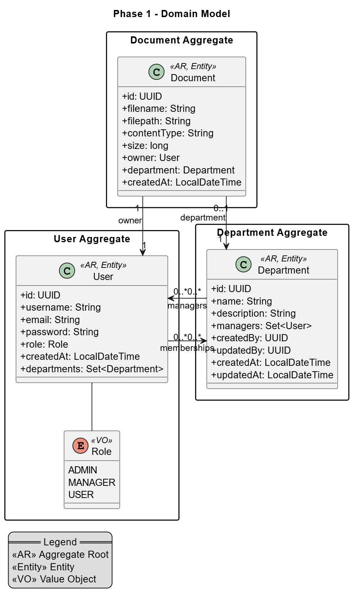
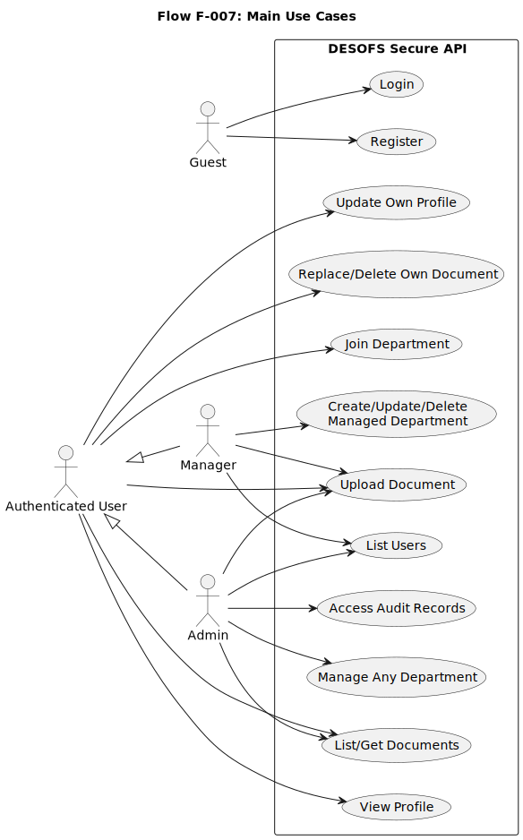
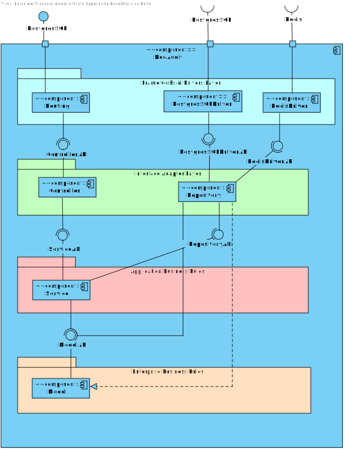
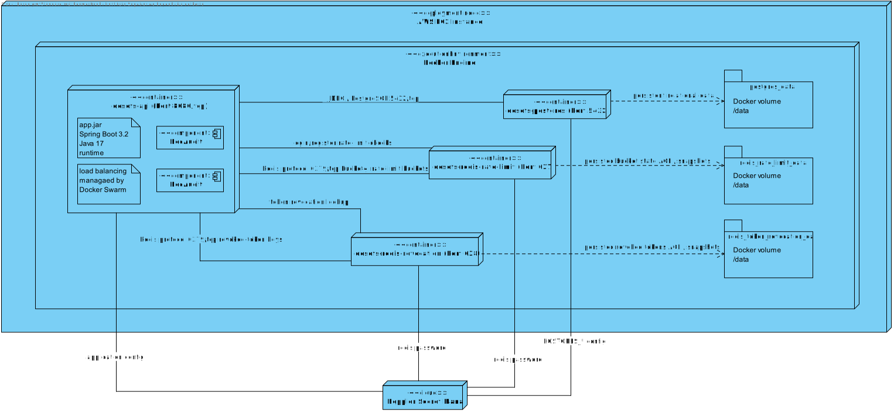

# MEI DESOFS – Secure REST API - DocAudit

Project for the course **Secure Software Development (DESOFS)**. 

With collaboration of:
- [@andrereis26](https://github.com/andrereis26)
- [@KirinDev](https://github.com/KirinDev)
- [@GuilhermeCunha79](https://github.com/GuilhermeCunha79)
- [@DiogoSilva1013](https://github.com/DiogoSilva1013)
- [@Franciscopeixoto47](https://github.com/Franciscopeixoto47)

## Objective

Develop a secure REST API following the SSDLC (Secure Software Development Life Cycle) process, applying Domain-Driven Design (DDD) principles and security best practices.


## What This App Is About

This project is a secure document management REST API named DocAudit, built with Spring Boot.

It allows users to register and authenticate, upload and manage documents, collaborate through departments, and keep an immutable audit trail of security-relevant actions.

The platform is designed for role-based governance (`ADMIN`, `MANAGER`, `USER`) with deny-by-default authorization and secure filesystem handling.

## Deliveries

- [Phase 1 Summary](Deliverables/Phase1/summary.md)
- [Phase 2 Sprint 1 Summary](Deliverables/Phase2/Sprint1/summary.md)
- [Phase 2 Sprint 2 Summary](Deliverables/Phase2/Sprint2/summary.md)

## Technologies

| Component | Technology |
|---|---|
| Framework | Spring Boot 3.2 (Java 17) |
| Database | PostgreSQL 15 |
| Migrations | Flyway |
| Authentication | JWT (Spring Security 6) |
| Build | Maven |
| Containerization | Docker / Docker Compose |
| Infrastructure | Terraform + AWS EC2 (`eu-west-3`) |

## Architecture Overview

### Domain Model – DDD

The application follows **Domain-Driven Design** with four main aggregates:

- **User** – User management and authentication
- **Document** – Document management with file storage
- **Audit** – Audit logging of all operations
- **Department** – Department, manager, and membership management



### Use Case Diagram



### Component Diagram



### Physical View Diagram


## Security Features

- **RBAC** with three roles: `ADMIN`, `MANAGER`, `USER`
- **JWT authentication** (stateless)
- **Password hashing** with BCrypt
- **File operations** protected against path traversal
- **Immutable audit log** for operations

## Repository Structure

```
├── backend/                  # Spring Boot source code
│   ├── src/main/java/com/desofs/project/
│   │   ├── config/           # Security configuration (JWT, Spring Security)
│   │   ├── domain/           # Business logic (DDD)
│   │   │   ├── user/         # Aggregate: Users
│   │   │   ├── document/     # Aggregate: Documents
│   │   │   ├── audit/        # Aggregate: Audit
│   │   │   └── department/   # Aggregate: Departments
│   │   ├── infrastructure/   # Infrastructure services (FileStorage)
│   │   └── interfaces/       # REST Controllers and DTOs
│   └── src/main/resources/
│       ├── application.yml   # Application configuration
│       └── db/migration/     # Flyway scripts
├── Deliverables/             # Documentation and OWASP ASVS checklists
│   ├── Phase1/               # Phase 1 summary
│   └── checklists/           # OWASP ASVS Checklist
├── .github/workflows/        # DevSecOps pipeline, release, and deployment automation
├── deployment/               # Swarm compose file and remote deployment script
├── infrastructure/terraform/ # AWS infrastructure provisioning and setup guide
├── docker-compose.yml        # Local all-in-one Docker development workflow
├── docker-compose-local.yml  # Local support services for Maven development
└── README.md
```


## How to Run

### Prerequisites

- Docker and Docker Compose
- Java 17+ and Maven (for local development)
- Duplicate the env.example file to .env and configure environment variables (optional, for local development)

### With Docker Compose

```bash
docker compose --env-file .env up -d --build
```

The API will be available at `http://localhost:8080`.

### Local Development
Duplicate the .env.local.example file to .env.local and configure environment variables and then run:

```bash
# Start only the required services (db, redis, etc)
docker compose -f docker-compose-local.yml --env-file .env.local up

# Run the application
cd backend && mvn spring-boot:run
```

### Production Image Build

The repository keeps two Dockerfiles on purpose:

- `backend/Dockerfile`: local development image build from source.
- `backend/Dockerfile.prod`: production runtime image used by the main workflow after the JAR artifact has already been built and validated.

To build the production image locally for inspection:

```bash
cd backend
mvn -DskipTests clean package
docker build --pull -f Dockerfile.prod -t desofs-api:local .
```

### Production Deployment Assets

- `infrastructure/terraform/envs/prod` provisions the AWS production host in `eu-west-3`, including networking, Elastic IP, SSH access controls, and an EC2 instance bootstrapped with Docker, Docker Compose, Doppler, and Docker Swarm.
- `infrastructure/terraform/README.md` explains the exact Terraform apply flow and the post-apply GitHub/Doppler setup you must complete.
- `deployment/docker-compose.swarm.yml` defines the Docker Swarm stack with:
  - 2 API replicas
  - `start-first` rolling updates with parallelism `1`
  - rollback-aware update policy
  - health checks for PostgreSQL, Redis, and the API readiness probe
  - resource reservations and limits
  - isolated internal overlay networking
- `deployment/remote-deploy.sh` renders the Swarm stack with Doppler-managed variables, deploys the stack, validates service convergence, checks the readiness endpoint, and rolls back the API service if validation fails.

The management health endpoints used for rollout validation are served on the management port (default `9090`):

- `GET http://<host>:9090/actuator/health`
- `GET http://<host>:9090/actuator/health/liveness`
- `GET http://<host>:9090/actuator/health/readiness`

### Run Tests

```bash
cd backend && mvn test
```

## How to contribute
Follow the guidelines in [**Guidelines**](Deliverables/Phase2/Sprint2/guidelines.md) for contributing to this project.


## API Endpoints

| Method | Endpoint | Role | Description |
|---|---|---|---|
| POST | `/api/auth/register` | Public | Register user |
| POST | `/api/auth/login` | Public | Authenticate and obtain JWT |
| POST | `/api/auth/logout` | Authenticated | Logout (stateless; client removes JWT) |
| GET | `/api/users` | ADMIN, MANAGER | List users |
| GET | `/api/users/{id}` | Authenticated | Get user |
| PUT | `/api/users/{id}` | Self, ADMIN | Update user |
| POST | `/api/documents/upload` | Authenticated | Upload document |
| GET | `/api/documents` | Authenticated | List documents |
| GET | `/api/documents/{id}` | Authenticated | Get document |
| DELETE | `/api/documents/{id}` | Self, department manager (member and/or manager), ADMIN | Delete document |
| PUT | `/api/documents/{id}/replace` | Self, department manager, ADMIN | Replace existing document |
| GET | `/api/departments` | Authenticated | List departments |
| GET | `/api/departments/{id}` | Authenticated | Get department by id |
| GET | `/api/departments/by-name/{name}` | Authenticated | Get department by name |
| POST | `/api/departments/{id}/join` | Authenticated | Join department |
| POST | `/api/departments` | ADMIN, MANAGER | Create department |
| PUT | `/api/departments/{id}` | ADMIN, department manager | Update department |
| DELETE | `/api/departments/{id}` | ADMIN, department manager | Delete department |


## Access Matrix (Role x Action) – Department + Document

### Department

| Action | ADMIN | MANAGER | USER |
|---|---|---|---|
| List departments | ✅ | ✅ | ✅ |
| Get department (id/name) | ✅ | ✅ | ✅ |
| Create department | ✅ | ✅ (own departments) | ❌ |
| Update department | ✅ | ✅ (if manager of department) | ❌ |
| Delete department | ✅ | ✅ (if manager of department) | ❌ |
| Join department (`join`) | ✅ | ✅ | ✅ |

### Document

| Action | ADMIN | MANAGER | USER |
|---|---|---|---|
| List/get documents | ✅ (all) | ✅ (departments where member and/or manager; and own) | ✅ (own) |
| Upload document | ✅ | ✅ (in departments where member and/or manager) | ✅ (own; department only if member) |
| Replace document | ✅ (all) | ✅ (departments where manager; or own) | ✅ (own) |
| Delete document | ✅ (all) | ✅ (departments where member and/or manager; or own) | ✅ (own) |


## Test Users
| Username | Password | Role | Department |
|---|---|---|---|
| bootstrap_admin | ChangeMe123! | ADMIN | - |
| bootstrap_manager | ChangeMe123! | MANAGER | Engineering |
| bootstrap_manager_2 | ChangeMe123! | MANAGER | Operations |
| bootstrap_manager_3 | ChangeMe123! | MANAGER | Compliance |
| bootstrap_user | ChangeMe123! | USER | Engineering |
| bootstrap_user_2 | ChangeMe123! | USER | Operations |
| bootstrap_user_3 | ChangeMe123! | USER | Compliance |
| bootstrap_user_4 | ChangeMe123! | USER | Engineering |


## DevSecOps Pipeline

Mandatory security and quality gates are enforced with GitHub Actions:

- `Feature Branch CI` (`.github/workflows/branch-workflow.yml`)
  - Lightweight push validation for non-main branches with build, unit tests, integration tests, and secret scanning.
- `Pull Request Validation` (`.github/workflows/pull-request-workflow.yml`)
  - Runs the full PR validation chain: build, unit tests, integration tests, secret scanning, SpotBugs, Dependency-Check, SonarQube, and the embedded `secure-coding-checklist` job for SDR-001.
- `Production DevSecOps Pipeline` (`.github/workflows/main-workflow.yml`)
  - Re-runs the protected-branch validation chain on `main` and `master`.
  - Builds a production image from the validated JAR artifact.
  - Runs a blocking Trivy image scan and archives the SARIF and text reports.
  - Publishes immutable Docker Hub image tags plus `latest`.
  - Creates or updates a GitHub Release with the version tag and published image digest.
  - Deploys the immutable image to the Terraform-provisioned AWS Docker Swarm host over SSH using the repository deployment assets.

### Required GitHub Secrets

- `SONAR_TOKEN`: SonarQube/SonarCloud token for the code-quality gate.
- `NVD_API_KEY`: NVD API key used by OWASP Dependency-Check.
- `GITLEAKS_LICENSE`: Optional Gitleaks license key if your selected configuration requires it.
- `DOCKERHUB_USERNAME`: Docker Hub account or robot username that owns the target repository.
- `DOCKERHUB_TOKEN`: Docker Hub access token used for image publication and remote registry login.
- `AWS_SSH_HOST`: Elastic IP or DNS name of the Terraform-provisioned AWS deployment host.
- `AWS_SSH_PORT`: SSH port for the deployment host, typically `22`.
- `AWS_SSH_USER`: SSH user exposed by the EC2 image, currently `ubuntu`.
- `AWS_SSH_PRIVATE_KEY`: Private key matching the public key provided to Terraform as `deployment_ssh_public_key`.
- `AWS_SSH_KNOWN_HOSTS`: Pinned `known_hosts` entry generated after `terraform apply`, for example with `ssh-keyscan -H $(terraform output -raw public_ip)`.
- `AWS_APP_BASE_URL`: Public application base URL used by GitHub-hosted post-deploy validation, typically `terraform output -raw app_base_url`. Include the public port when it is not `80`, for example `http://<public-app-host>:8080`.
- `AWS_HEALTHCHECK_URL`: EC2-local readiness URL used by the remote deploy and rollback scripts, typically `terraform output -raw healthcheck_url`.
- `DOPPLER_PROJECT`: Doppler project name used for deployment-time secret injection.
- `DOPPLER_CONFIG`: Doppler config/environment name used for deployment.
- `DOPPLER_TOKEN`: Doppler service token used by the deployment workflow to render the production stack securely.
